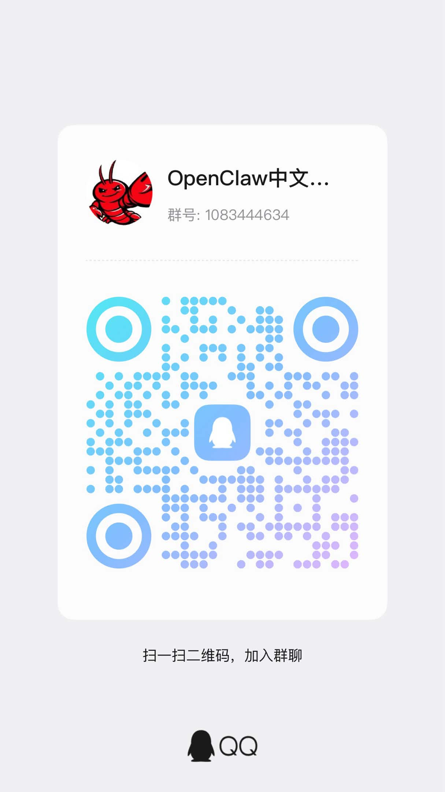

# 🧠 DC Channel Memory (DC 群聊记忆)

> **智能管理 Discord 群聊记忆**
> 
> 按频道分离存储，支持人员识别和私聊总结查询
> 
> **Smart Discord Channel Memory Management**
> 
> Channel-separated storage with user identification and private summary queries

[](https://opensource.org/licenses/MIT)
[](https://openclaw.ai)
[](https://www.python.org/)
[](https://discord.com/developers/docs)

---

## 📋 目录 / Table of Contents

- [功能特性 / Features](#-功能特性--features)
- [快速开始 / Quick Start](#-快速开始--quick-start)
- [配置说明 / Configuration](#-配置说明--configuration)
- [使用示例 / Usage Examples](#-使用示例--usage-examples)
- [数据存储 / Data Storage](#-数据存储--data-storage)
- [隐私说明 / Privacy](#-隐私说明--privacy)
- [社群 / Community](#-社群--community)
- [许可证 / License](#-许可证--license)

---

## ✨ 功能特性 / Features

### 🇨🇳 中文

- 📁 **按频道分离存储** - 每个 Discord 频道独立的记忆目录，便于长期管理
- 👤 **人员识别系统** - 自动记录用户 ID 和名称映射，支持标注真实姓名和角色
- 🔍 **私聊总结查询** - 私聊时可安全查询群聊概况，不泄露具体对话内容
- 📊 **智能分析** - 自动统计消息趋势、活跃时间、参与人数
- 🔒 **隐私保护** - 敏感信息自动过滤，支持数据保留期限配置
- 📈 **数据分析** - 消息统计、活跃用户排行、话题趋势分析

### 🇺🇸 English

- 📁 **Channel-Separated Storage** - Independent memory directory for each Discord channel
- 👤 **User Identification System** - Auto-record user ID and name mapping, support real names and roles
- 🔍 **Private Summary Query** - Safely query channel overview in DM without leaking specific conversations
- 📊 **Smart Analytics** - Auto-statistics message trends, active hours, participant count
- 🔒 **Privacy Protection** - Auto-filter sensitive info, support data retention configuration
- 📈 **Data Analytics** - Message statistics, active user ranking, topic trend analysis

---

## 🚀 快速开始 / Quick Start

### 🇨🇳 中文

#### 1. 安装

```bash
# 进入 OpenClaw 技能目录
cd ~/.openclaw/skills

# 克隆仓库
git clone https://github.com/XHJ-Studio/dc-channel-memory.git

# 安装依赖
cd dc-channel-memory
pip3 install -r requirements.txt
```

#### 2. 配置

在 `~/.openclaw/openclaw.json` 中添加：

```json
{
  "skills": {
    "entries": {
      "discord_channel_memory": {
        "enabled": true
      }
    }
  }
}
```

#### 3. 使用

在 OpenClaw 对话中直接询问：
- "查看频道 1477961192604569703 的概况"
- "用户 小黄鸡工坊 是谁？"

### 🇺🇸 English

#### 1. Installation

```bash
# Navigate to OpenClaw skills directory
cd ~/.openclaw/skills

# Clone repository
git clone https://github.com/XHJ-Studio/dc-channel-memory.git

# Install dependencies
cd dc-channel-memory
pip3 install -r requirements.txt
```

#### 2. Configuration

Add to `~/.openclaw/openclaw.json`:

```json
{
  "skills": {
    "entries": {
      "discord_channel_memory": {
        "enabled": true
      }
    }
  }
}
```

#### 3. Usage

Ask directly in OpenClaw conversation:
- "View summary of channel 1477961192604569703"
- "Who is user 小黄鸡工坊？"

---

## ⚙️ 配置说明 / Configuration

### 🇨🇳 中文

**必需配置**:
- Discord Bot Token (在 openclaw.json 中已配置)
- 记忆存储路径：`~/.openclaw/memory/`
- Python 3.8+ 环境

**可选配置**:
```json
{
  "memory": {
    "retention_days": 30,
    "auto_cleanup": true,
    "privacy_mode": "strict",
    "analytics_enabled": true
  }
}
```

### 🇺🇸 English

**Required Configuration**:
- Discord Bot Token (configured in openclaw.json)
- Memory storage path: `~/.openclaw/memory/`
- Python 3.8+ environment

**Optional Configuration**:
```json
{
  "memory": {
    "retention_days": 30,
    "auto_cleanup": true,
    "privacy_mode": "strict",
    "analytics_enabled": true
  }
}
```

---

## 💬 使用示例 / Usage Examples

### 🇨🇳 中文

#### 命令行工具

```bash
# 查询频道概况（最近 7 天）
python3 scripts/query_memory.py --channel <channel_id> --summary --days 7

# 查询用户信息（支持用户名或用户 ID）
python3 scripts/query_memory.py --user <username>

# 列出所有已知用户
python3 scripts/query_memory.py --list-users
```

#### Python API

```python
from scripts.memory_manager import DiscordChannelMemory

# 初始化
memory = DiscordChannelMemory()

# 保存消息
memory.save_message('channel_id', {
    'message_id': '12345',
    'user_id': '67890',
    'username': '用户名',
    'content': '消息内容',
    'timestamp': '2026-03-06T12:00:00',
    'hour': 12,
    'was_mentioned': False
})

# 识别/获取用户信息
identity = memory.identify_user('67890', '用户名', '频道昵称')

# 更新用户身份
memory.update_user_identity('67890', 
                           real_name='真实姓名', 
                           role='角色', 
                           notes='备注')

# 获取频道概况
summary = memory.get_channel_summary('channel_id', days=7)

# 获取用户信息
user = memory.get_user_info(user_id='67890')
```

### 🇺🇸 English

#### Command Line Tools

```bash
# Query channel summary (last 7 days)
python3 scripts/query_memory.py --channel <channel_id> --summary --days 7

# Query user info (supports username or user ID)
python3 scripts/query_memory.py --user <username>

# List all known users
python3 scripts/query_memory.py --list-users
```

#### Python API

```python
from scripts.memory_manager import DiscordChannelMemory

# Initialize
memory = DiscordChannelMemory()

# Save message
memory.save_message('channel_id', {
    'message_id': '12345',
    'user_id': '67890',
    'username': 'Username',
    'content': 'Message content',
    'timestamp': '2026-03-06T12:00:00',
    'hour': 12,
    'was_mentioned': False
})

# Identify/Get user info
identity = memory.identify_user('67890', 'Username', 'Channel Nickname')

# Update user identity
memory.update_user_identity('67890', 
                           real_name='Real Name', 
                           role='Role', 
                           notes='Notes')

# Get channel summary
summary = memory.get_channel_summary('channel_id', days=7)

# Get user info
user = memory.get_user_info(user_id='67890')
```

---

## 📁 数据存储 / Data Storage

### 🇨🇳 中文

**存储结构**:
```
~/.openclaw/memory/
├── channels/
│   ├── <channel_id>/
│   │   ├── messages.json      # 消息记录
│   │   └── users.json         # 用户身份
│   └── ...
└── analytics/
    └── reports/               # 分析报告
```

**消息记录格式**:
```json
{
  "message_id": "1479403049658220645",
  "user_id": "1103263501755105321",
  "username": "小黄鸡工坊",
  "content": "消息内容",
  "timestamp": "2026-03-06T17:33:31",
  "hour": 17,
  "was_mentioned": false
}
```

**用户身份格式**:
```json
{
  "user_id": "1103263501755105321",
  "username": "小黄鸡工坊",
  "nickname": "老板",
  "username_history": ["小黄鸡工坊"],
  "real_name": "真实姓名",
  "role": "角色",
  "tags": [],
  "notes": "备注信息",
  "first_seen": "2026-03-06T17:33:41",
  "last_seen": "2026-03-06T17:33:41"
}
```

### 🇺🇸 English

**Storage Structure**:
```
~/.openclaw/memory/
├── channels/
│   ├── <channel_id>/
│   │   ├── messages.json      # Message records
│   │   └── users.json         # User identities
│   └── ...
└── analytics/
    └── reports/               # Analytics reports
```

**Message Record Format**:
```json
{
  "message_id": "1479403049658220645",
  "user_id": "1103263501755105321",
  "username": "小黄鸡工坊",
  "content": "Message content",
  "timestamp": "2026-03-06T17:33:31",
  "hour": 17,
  "was_mentioned": false
}
```

**User Identity Format**:
```json
{
  "user_id": "1103263501755105321",
  "username": "小黄鸡工坊",
  "nickname": "Boss",
  "username_history": ["小黄鸡工坊"],
  "real_name": "Real Name",
  "role": "Role",
  "tags": [],
  "notes": "Notes",
  "first_seen": "2026-03-06T17:33:41",
  "last_seen": "2026-03-06T17:33:41"
}
```

---

## 🔒 隐私说明 / Privacy

### 🇨🇳 中文

**隐私保护措施**:
- ✅ 所有数据存储在本地，不上传任何云端服务
- ✅ 私聊查询只返回概况统计，不展示具体消息内容
- ✅ 用户可随时删除自己的身份记录
- ✅ 支持配置数据保留期限
- ✅ 敏感信息自动过滤（密码、token 等）

**数据保留**:
- 默认保留：30 天
- 可配置范围：1-365 天
- 自动清理：每天凌晨 2 点

### 🇺🇸 English

**Privacy Protection**:
- ✅ All data stored locally, no cloud upload
- ✅ DM queries return only summary statistics, no specific message content
- ✅ Users can delete their identity records anytime
- ✅ Support configurable data retention period
- ✅ Auto-filter sensitive info (passwords, tokens, etc.)

**Data Retention**:
- Default: 30 days
- Configurable range: 1-365 days
- Auto cleanup: Daily at 2:00 AM

---

## 📊 统计分析 / Analytics

### 🇨🇳 中文

**提供的分析功能**:
- 📈 消息趋势图（按小时/天/周）
- 👥 活跃用户排行
- ⏰ 活跃时间段分析
- 🔥 热门话题提取
- 📊 参与度统计

### 🇺🇸 English

**Analytics Features**:
- 📈 Message trends (hourly/daily/weekly)
- 👥 Active user ranking
- ⏰ Active hours analysis
- 🔥 Hot topic extraction
- 📊 Engagement statistics

---

## 👥 社群 / Community

### 🇨🇳 中文

欢迎加入 OpenClaw 中文交流群！



**群信息**:
- 群名：OpenClaw 中文交流群
- 群号：1083444634
- 用途：OpenClaw 用户交流、技能分享、问题讨论

*扫码加入 OpenClaw 中文交流群*

### 🇺🇸 English

Welcome to join OpenClaw Chinese Community!


**Group Info**:
- Group Name: OpenClaw Chinese Community
- Group ID: 1083444634
- Purpose: OpenClaw user communication, skill sharing, Q&A

*Scan QR code to join the community*

---

## 📄 许可证 / License

### 🇨🇳 中文
MIT License - 详见 [LICENSE](./LICENSE) 文件

### 🇺🇸 English
MIT License - See [LICENSE](./LICENSE) file for details

---

## 🙏 致谢 / Acknowledgments

### 🇨🇳 中文
- **OpenClaw** - AI 助手框架
- **Discord.py** - Discord API 封装库

### 🇺🇸 English
- **OpenClaw** - AI assistant framework
- **Discord.py** - Discord API wrapper

---

## 📞 联系 / Contact

### 🇨🇳 中文
- **GitHub**: [@XHJ-Studio](https://github.com/XHJ-Studio)
- **Issues**: [问题反馈](https://github.com/XHJ-Studio/dc-channel-memory/issues)

### 🇺🇸 English
- **GitHub**: [@XHJ-Studio](https://github.com/XHJ-Studio)
- **Issues**: [Report Issues](https://github.com/XHJ-Studio/dc-channel-memory/issues)

---

> **"记住每一次交流，珍视每一份连接"** 🧠
> 
> *"Remember every interaction, cherish every connection"*

*Made with ❤️ by 小黄鸡工坊 | Powered by OpenClaw*
